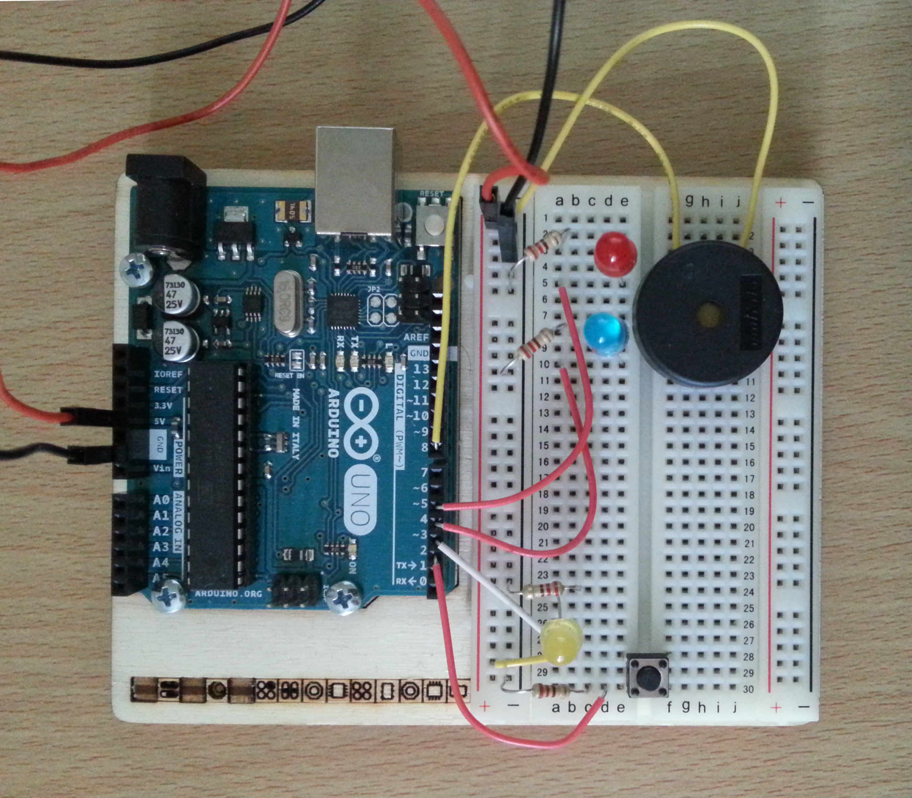

# arduino-foo
There are several arduino projects on this repo. For each of them find a description below.

## PoliceStation
The effect of the emergency lighting and siren.

To activate it just press the button.

[

]
(PoliceStation/media/PoliceStation.mp4)
